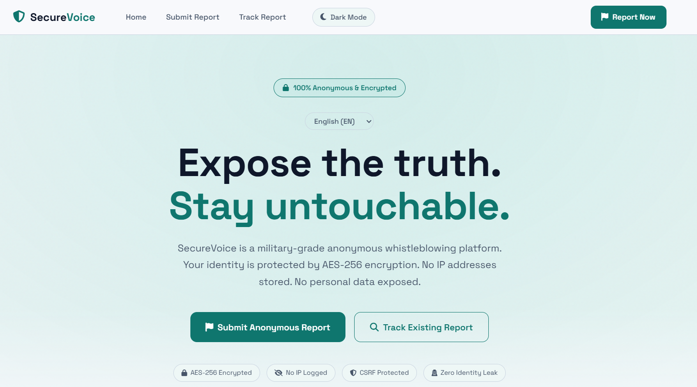
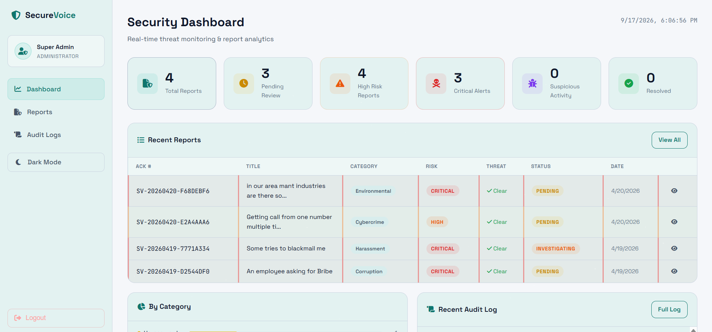
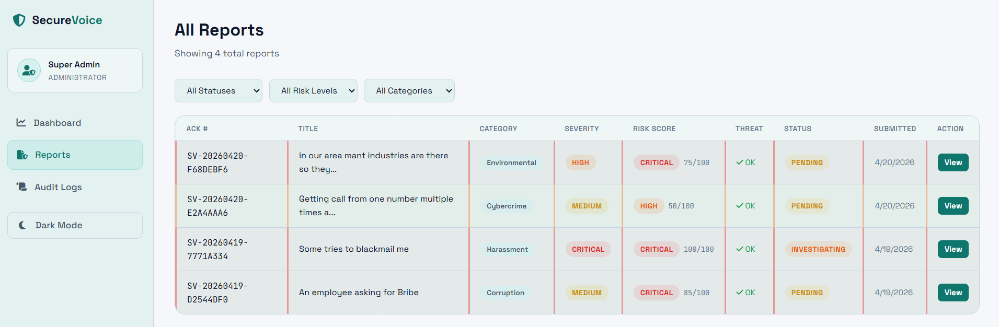
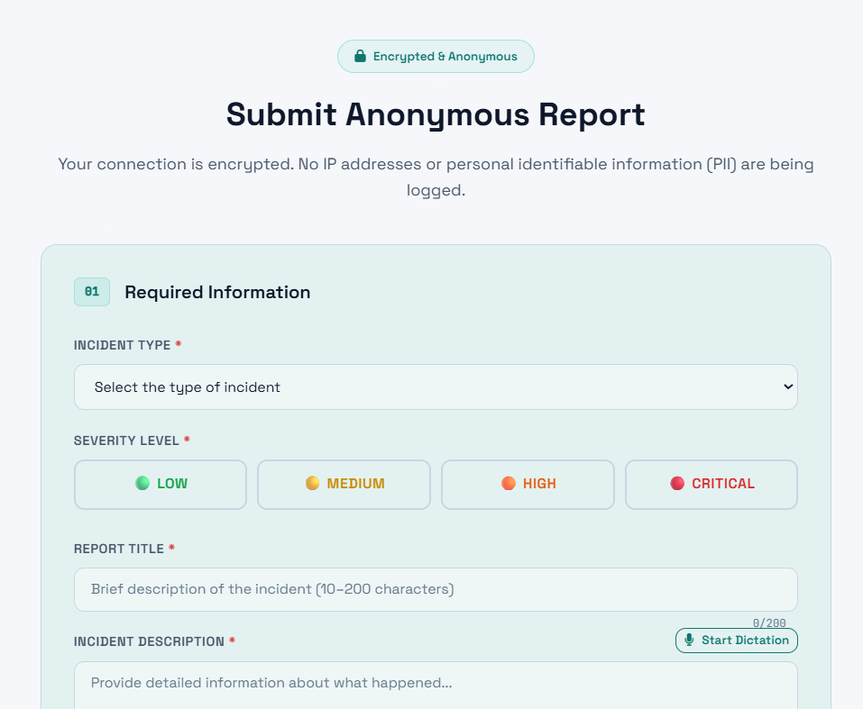
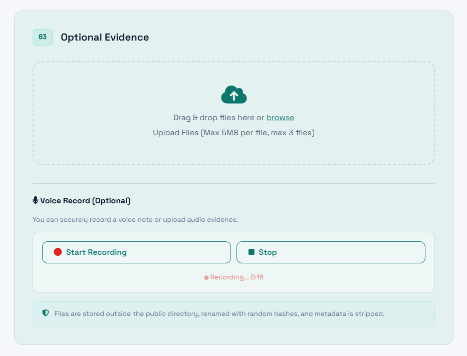
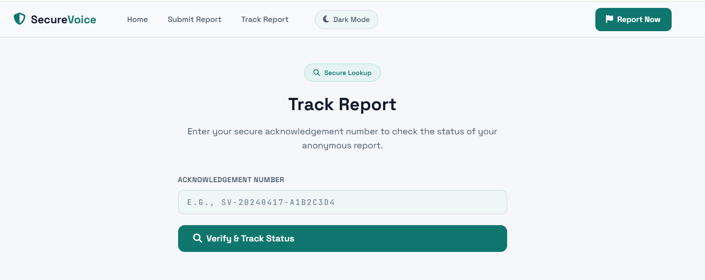
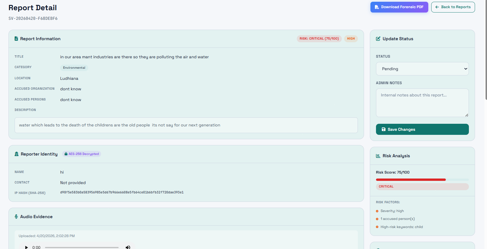
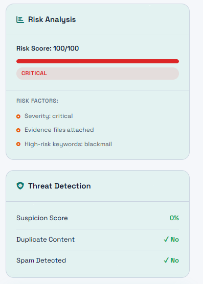
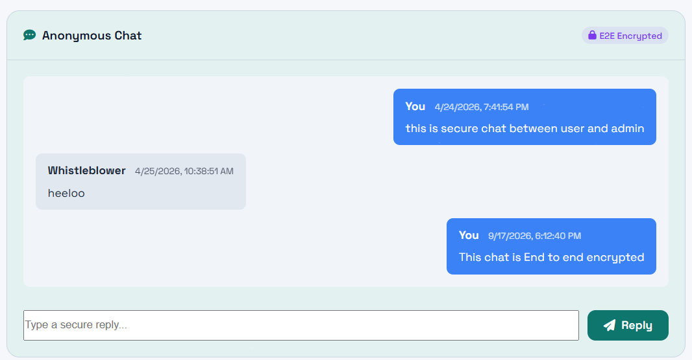
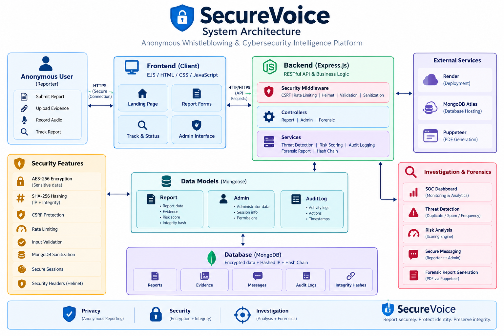

# 🔐 SecureVoice

### Anonymous Whistleblowing & Cybersecurity Intelligence Platform

> A security-focused whistleblowing platform designed to protect reporter identity, preserve evidence, detect suspicious activity, and provide authorized investigators with a complete case-management and forensic workflow.

<p align="center">

[](YOUR_LIVE_DEMO_URL)
[](YOUR_GITHUB_URL)
[](https://nodejs.org/)
[](https://expressjs.com/)
[](https://www.mongodb.com/)
[](https://render.com/)

</p>

<p align="center">
  
</p>

---

## 🚨 The Problem

Whistleblowers often need to report sensitive incidents without exposing their identity or compromising the evidence they provide.

Traditional reporting systems can introduce several security and operational risks:

* 🔓 Exposure of reporter identity
* 📝 Unauthorized modification of submitted reports
* 🌐 Direct storage of sensitive IP information
* 🚨 Spam, duplicate, or high-frequency submissions
* 🔍 Limited investigation and case-tracking capabilities
* 📄 Lack of structured forensic evidence
* 🔐 Weak protection for communication between reporters and investigators

SecureVoice approaches the problem as a **security workflow rather than a simple reporting form**.

The platform combines privacy-preserving data handling, cryptographic protection, threat detection, investigation tools, audit logging, and forensic reporting into one system.

---

# 🛡️ What is SecureVoice?

SecureVoice is an anonymous whistleblowing and cybersecurity reporting platform built with **Node.js, Express, MongoDB, and EJS**.

A reporter can submit an incident, optionally attach documents/images/audio, and receive an acknowledgement number for anonymous tracking.

On the investigation side, authorized administrators can:

* review submitted reports
* analyze risk and suspicious activity
* communicate with reporters
* update case status
* inspect evidence
* verify integrity information
* review audit activity
* generate forensic PDF reports

The goal is to create a workflow where **reporter privacy, evidence integrity, and investigator visibility are considered together**.

---

# ⭐ Core Capabilities

| Capability               | Description                                                                   |
| ------------------------ | ----------------------------------------------------------------------------- |
| 🕵️ Anonymous Reporting  | Submit incidents without requiring a conventional user account                |
| 🔐 Identity Protection   | Reporter name/contact information can be encrypted before storage             |
| 📎 Evidence Upload       | Supports documents, images, PDFs, and other permitted evidence types          |
| 🎙️ Audio Evidence       | Browser-based voice recording and audio submission                            |
| 🔎 Anonymous Tracking    | Track reports using an acknowledgement number                                 |
| 💬 Secure Messaging      | Reporter ↔ administrator communication through the report                     |
| 🚨 Threat Detection      | Identifies duplicate, spam, and high-frequency submission patterns            |
| 📊 Risk Scoring          | Calculates report risk using defined report characteristics                   |
| 🛰️ SOC Dashboard        | Centralized investigator dashboard for monitoring cases                       |
| 📝 Audit Logging         | Records important administrator actions                                       |
| ⛓️ Hash Chaining         | Provides a blockchain-style, tamper-evident integrity mechanism               |
| 📄 Forensic Reports      | Generates structured forensic PDF reports                                     |
| 🛡️ Application Security | CSRF protection, rate limiting, validation, sanitization, and secure sessions |

---

# 🔐 Security Features

## 1. 🔒 Reporter Identity Encryption

Sensitive reporter information such as:

* Name
* Contact information

is encrypted before being stored in MongoDB.

The encryption implementation uses:

* AES-256
* Unique initialization vector (IV) per encryption operation
* Controlled decryption within authorized administrative workflows

### Data flow

```text
Reporter Information
        │
        ▼
   AES-256 Encryption
        │
        ▼
Encrypted Data
        │
        ▼
     MongoDB
        │
        ▼
Authorized Admin
        │
        ▼
     Decryption
```

---

## 2. 🧂 Privacy-Preserving IP Handling

SecureVoice does not store the reporter's IP address directly as a normal database field.

Instead, the IP is transformed using **SHA-256 hashing with a salt**.

```text
Original IP
     │
     ▼
+ Salt
     │
     ▼
SHA-256
     │
     ▼
Stored IP Hash
```

This allows the system to perform certain detection and correlation operations without directly retaining the original IP value.

---

## 3. ⛓️ Tamper-Evident Hash Chaining

Reports participate in a blockchain-style hash chain.

Each record can reference integrity information from the previous record.

```text
┌────────────┐
│  Report 1  │
└─────┬──────┘
      │
      ▼
    Hash 1
      │
      ▼
┌────────────┐
│  Report 2  │ + Previous Hash
└─────┬──────┘
      │
      ▼
    Hash 2
      │
      ▼
┌────────────┐
│  Report 3  │ + Previous Hash
└─────┬──────┘
      │
      ▼
    Hash 3
```

The objective is to make unauthorized modification of chained integrity information detectable.

> **Note:** SecureVoice uses a blockchain-style/hash-chain integrity mechanism; it is not presented as a decentralized blockchain network or cryptocurrency system.

---

# 🚨 Threat Detection & Risk Analysis

SecureVoice contains a dedicated detection and scoring layer for submitted reports.

### Threat detection considers patterns such as:

* Duplicate report content
* Repeated submissions
* High-frequency submissions
* Spam-like behavior
* Suspicious activity patterns

### Risk scoring considers factors including:

* Report severity
* Report category
* Attached evidence
* Accused parties
* Relevant keywords
* Other defined report characteristics

The system produces a **suspicion/risk score** that helps investigators prioritize reports for review.

```text
                    Report
                      │
          ┌───────────┴───────────┐
          ▼                       ▼
   Threat Detection          Risk Scoring
          │                       │
          ▼                       ▼
 Duplicate / Spam          Severity / Category
 Frequency Patterns        Evidence / Keywords
          │                       │
          └───────────┬───────────┘
                      ▼
              Investigation View
```

---

# 🛰️ SOC-Style Investigation Dashboard

SecureVoice provides an administrator-facing dashboard designed around a security investigation workflow.

<p align="center">
  
</p>

### Dashboard capabilities

* 📊 Total report statistics
* ⏳ Pending reports
* 🚨 High-risk reports
* 🔴 Critical-risk reports
* 📈 Category distribution
* 🕵️ Suspicious activity indicators
* 📝 Recent reports
* 📋 Audit activity
* 🔎 Report investigation

The dashboard provides administrators with a centralized view of the reporting environment.

---

# 🔄 How SecureVoice Works

## End-to-End Reporting Flow

```text
┌──────────────────────┐
│    Anonymous User    │
└──────────┬───────────┘
           │
           ▼
┌──────────────────────┐
│  Submit Report Form  │
└──────────┬───────────┘
           │
           ▼
┌──────────────────────┐
│ Input Validation     │
│ CSRF Verification    │
└──────────┬───────────┘
           │
           ▼
┌──────────────────────┐
│ Threat Detection     │
│ & Risk Scoring       │
└──────────┬───────────┘
           │
           ├─────────────────┐
           ▼                 ▼
┌──────────────────┐  ┌──────────────────┐
│ Identity         │  │ Integrity        │
│ Encryption       │  │ Hashing/Chaining │
└────────┬─────────┘  └────────┬─────────┘
         │                     │
         └──────────┬──────────┘
                    ▼
          ┌──────────────────┐
          │   MongoDB Atlas  │
          └────────┬─────────┘
                   │
                   ▼
          ┌──────────────────┐
          │ Admin / SOC      │
          │ Dashboard        │
          └────────┬─────────┘
                   │
          ┌────────┴─────────┐
          ▼                  ▼
   Secure Messaging    Forensic Report
                           PDF
```

---

# 🔄 Anonymous Reporting Workflow

### Step 1 — Submit

The reporter enters incident information through the public reporting interface.

### Step 2 — Protect

Sensitive identity information is encrypted and the IP address is transformed into a salted hash.

### Step 3 — Analyze

The system evaluates the report for suspicious patterns and calculates a risk score.

### Step 4 — Preserve

Integrity-related hashes and report metadata are stored with the report.

### Step 5 — Track

The reporter receives an acknowledgement number that can be used to check the report status.

### Step 6 — Investigate

Authorized administrators review the report and its evidence through the investigation dashboard.

### Step 7 — Communicate

The reporter and administrator can exchange messages through the report's secure communication workflow.

### Step 8 — Document

Investigators can generate a structured forensic PDF containing relevant case information and integrity data.

---

# 💬 Anonymous / Dead-Drop Messaging

A report can contain a communication thread between the reporter and the administrator.

This enables:

```text
Reporter
   │
   │ Anonymous message
   ▼
SecureVoice Report
   │
   │ Admin response
   ▼
Reporter
```

The communication is associated with the report rather than requiring the reporter to create a conventional account.

This supports follow-up communication while maintaining the anonymous reporting workflow.

---

# 📎 Evidence Management

Reports can contain supporting evidence.

Supported workflows include:

* 📄 Documents
* 🖼️ Images
* 📑 PDFs
* 🎵 Audio
* 🎙️ Browser-recorded voice evidence

Uploaded files are handled through Multer with configured file restrictions and are stored outside the public web directory.

Randomized filenames are used to reduce direct filename-based metadata exposure.

---

# 🎙️ Voice Evidence

SecureVoice supports browser-based audio recording.

```text
Browser Microphone
        │
        ▼
Audio Recording
        │
        ▼
Report Submission
        │
        ▼
Evidence Storage
        │
        ▼
Authorized Admin Review
```

Administrators can review submitted audio evidence from the report investigation interface.

---

# 📄 Forensic Report Engine

SecureVoice can generate structured forensic PDF reports using **Puppeteer**.

A generated report can include:

* Report information
* Reporter identity where authorized
* Evidence summary
* Risk analysis
* Threat indicators
* Cryptographic hashes
* Integrity information
* Status history
* Audit trail

```text
Report
  │
  ├── Case Information
  ├── Evidence
  ├── Risk Analysis
  ├── Threat Indicators
  ├── Hashes
  ├── Status History
  └── Audit Trail
          │
          ▼
   Forensic PDF
```

<p align="center">
  
</p>

---

# 📋 Audit Logging

Administrative actions are recorded through the audit logging system.

Examples include:

* Administrator login
* Administrator logout
* Report status changes
* Administrative replies
* Forensic PDF generation
* Integrity verification actions

This provides an activity trail for investigation and accountability.

---

# 🛡️ Application Security Controls

SecureVoice includes multiple application-level security controls.

### CSRF Protection

State-changing requests are protected using CSRF validation.

### Rate Limiting

Rate limits are applied to sensitive endpoints to reduce abuse and automated attacks.

### Input Validation

Report fields are validated before processing.

### MongoDB Sanitization

MongoDB query/input sanitization is used to reduce injection-related risks.

### Secure Sessions

Administrative sessions use security-oriented cookie configuration including:

* `httpOnly`
* `sameSite`
* `secure` in production

### File Restrictions

Uploaded evidence is subject to configured:

* file type restrictions
* file size limits
* controlled upload handling

### Security Headers

Helmet is used as part of the application's security middleware configuration.

---

# 🖥️ Inside the App

> Add your actual screenshots to `docs/screenshots/` using the filenames below.

## 🏠 Landing Page

<p align="center">
  
</p>

---

## 📝 Anonymous Report Submission

<p align="center">
  
</p>

---

## 🎙️ Voice Evidence Recording

<p align="center">
  
</p>

---

## 🔎 Report Tracking

<p align="center">
  
</p>

---

## 🛰️ SOC Dashboard

<p align="center">
  
</p>

---

## 📊 Report Investigation

<p align="center">
  
</p>

---

## 🚨 Threat & Risk Analysis

<p align="center">
  
</p>

---

## 💬 Secure Messaging

<p align="center">
  
</p>

---

## 📄 Forensic Report

<p align="center">
  
</p>

---

# 🏗️ System Architecture

<p align="center">
  
</p>

### Architecture Overview

```text
                     ┌─────────────────────┐
                     │    Public Client    │
                     │  EJS / HTML / JS    │
                     └──────────┬──────────┘
                                │
                                ▼
                     ┌─────────────────────┐
                     │     Express.js      │
                     │     Application     │
                     └──────────┬──────────┘
                                │
             ┌──────────────────┼──────────────────┐
             │                  │                  │
             ▼                  ▼                  ▼
       ┌───────────┐      ┌────────────┐    ┌──────────────┐
       │ Security  │      │ Controllers│    │   Services   │
       │ Middleware│      │            │    │              │
       └─────┬─────┘      └──────┬─────┘    └──────┬───────┘
             │                   │                 │
             │                   └────────┬────────┘
             │                            │
             │                            ▼
             │                    ┌─────────────────┐
             │                    │    Mongoose     │
             │                    └────────┬────────┘
             │                             │
             │                             ▼
             │                    ┌─────────────────┐
             │                    │ MongoDB Atlas   │
             │                    └─────────────────┘
             │
             └──────────────────────────────────────┐
                                                    │
                                                    ▼
                                           ┌────────────────┐
                                           │ Forensic Engine│
                                           │   Puppeteer    │
                                           └────────────────┘
```

---

# 🧩 Project Architecture

```text
securevoice/
│
├── server.js
├── setup.js
├── package.json
├── .env
├── .render-build.sh
│
├── controllers/
│   ├── reportController.js
│   ├── adminController.js
│   └── forensicReportController.js
│
├── models/
│   ├── Report.js
│   ├── Admin.js
│   └── AuditLog.js
│
├── routes/
│   ├── reportRoutes.js
│   └── adminRoutes.js
│
├── middleware/
│   ├── auth.js
│   ├── csrfProtection.js
│   └── upload.js
│
├── services/
│   ├── auditService.js
│   ├── forensicReportService.js
│   ├── riskScoring.js
│   └── threatDetection.js
│
├── utils/
│   ├── encryption.js
│   └── blockchain.js
│
├── views/
│   ├── home.ejs
│   ├── submit.ejs
│   ├── track.ejs
│   ├── dashboard.ejs
│   ├── reports.ejs
│   └── reportDetail.ejs
│
└── public/
    ├── css/
    └── js/
```

---

# 🛠️ Tech Stack

## Backend

* **Node.js**
* **Express.js**
* **EJS**
* **Mongoose**

## Database

* **MongoDB**
* **MongoDB Atlas**

## Security

* AES-256 encryption
* SHA-256 hashing
* Salted IP hashing
* CSRF protection
* Rate limiting
* Input validation
* MongoDB sanitization
* Helmet security middleware
* Secure session configuration

## Detection & Investigation

* Threat detection engine
* Risk scoring engine
* Suspicion scoring
* Duplicate detection
* Frequency analysis
* Audit logging
* Hash-chain integrity

## Evidence & Forensics

* Multer
* Browser Media APIs
* Puppeteer
* PDF generation

## Deployment

* Render
* MongoDB Atlas

---

# 📁 Main Components

| Component                     | Responsibility                                                      |
| ----------------------------- | ------------------------------------------------------------------- |
| `server.js`                   | Application entry point and middleware configuration                |
| `reportController.js`         | Report submission, tracking, and reporter messaging                 |
| `adminController.js`          | Administrator authentication, dashboard, investigation, and actions |
| `forensicReportController.js` | Forensic report and integrity endpoints                             |
| `Report.js`                   | Report and evidence data model                                      |
| `Admin.js`                    | Administrator data model                                            |
| `AuditLog.js`                 | Administrative activity records                                     |
| `encryption.js`               | Encryption and hashing utilities                                    |
| `threatDetection.js`          | Suspicious/duplicate/frequency detection                            |
| `riskScoring.js`              | Report risk calculation                                             |
| `blockchain.js`               | Hash-chain integrity functionality                                  |
| `forensicReportService.js`    | Forensic PDF generation                                             |
| `csrfProtection.js`           | CSRF validation                                                     |
| `upload.js`                   | Evidence upload handling                                            |
| `auth.js`                     | Administrator authorization                                         |

---

# 🌐 Application Routes

| Page             | Local URL                               |
| ---------------- | --------------------------------------- |
| 🏠 Home          | `http://localhost:3000`                 |
| 📝 Submit Report | `http://localhost:3000/report/submit`   |
| 🔎 Track Report  | `http://localhost:3000/report/track`    |
| 🔐 Admin Login   | `http://localhost:3000/admin/login`     |
| 🛰️ Dashboard    | `http://localhost:3000/admin/dashboard` |

---

# 🚀 Quick Start

## Prerequisites

Make sure you have:

* Node.js LTS
* MongoDB Atlas account
* Git

---

## 1. Clone the Repository

```bash
git clone YOUR_GITHUB_URL
cd securevoice
```

---

## 2. Install Dependencies

```bash
npm install
```

---

## 3. Configure Environment Variables

Create a `.env` file in the project root.

Example:

```env
MONGODB_URI=your_mongodb_connection_string

ADMIN_EMAIL=your_admin_email
ADMIN_PASSWORD=your_admin_password

SESSION_SECRET=your_session_secret
ENCRYPTION_KEY=your_encryption_key
CSRF_SECRET=your_csrf_secret
```

> Do not commit `.env` or production secrets to GitHub.

Use the exact environment variable names expected by your current implementation.

---

## 4. Initialize the Administrator

Run the setup script once:

```bash
node setup.js
```

The administrator credentials should be configured through environment variables rather than hardcoded in the repository.

---

## 5. Start the Development Server

```bash
npm run dev
```

The application should now be available at:

```text
http://localhost:3000
```

---

# 🔑 Administrator Configuration

SecureVoice does not rely on hardcoded default administrator credentials.

Administrator credentials are configured through environment variables and initialized using:

```bash
node setup.js
```

### Security recommendation

For deployment:

* use strong unique credentials
* never commit `.env`
* never expose encryption keys
* never expose session secrets
* rotate secrets when necessary

---

# ☁️ Deployment on Render

SecureVoice includes a Render deployment configuration.

## Deployment Steps

### 1. Push the project to GitHub

```bash
git add .
git commit -m "Prepare SecureVoice for deployment"
git push
```

### 2. Create a Render Web Service

Connect your GitHub repository to Render.

### 3. Configure the Build Command

```bash
chmod +x .render-build.sh && ./.render-build.sh
```

### 4. Configure the Start Command

```bash
npm start
```

### 5. Configure Environment Variables

Add the required secrets from your local `.env` configuration to Render's environment-variable settings.

### 6. Deploy

After deployment, verify:

* application availability
* database connectivity
* administrator authentication
* report submission
* report tracking
* evidence handling
* PDF generation

---

# 🔐 Security Design Principles

SecureVoice follows several security-oriented design principles:

### 🔒 Minimize sensitive data exposure

Sensitive reporter information is encrypted rather than stored directly in plaintext.

### 🧂 Reduce direct IP exposure

IP addresses are represented using salted hashes.

### 🛡️ Protect state-changing operations

CSRF validation and request protections are applied to relevant workflows.

### 🚨 Detect suspicious behavior

Submission patterns are analyzed to identify potential spam or abnormal activity.

### ⛓️ Preserve integrity

Cryptographic hashes and hash chaining provide tamper-evident integrity information.

### 📝 Maintain accountability

Administrative actions are recorded through audit logging.

### 📄 Preserve investigation context

Relevant case information can be consolidated into forensic PDF reports.

---

# ⚠️ Security Considerations

SecureVoice is an academic/portfolio cybersecurity project demonstrating practical security mechanisms and investigation workflows.

It should **not be treated as a fully audited production whistleblowing platform** without additional security review.

For a real-world deployment, further work would be appropriate in areas such as:

* Independent penetration testing
* Cryptographic review
* Production key-management infrastructure
* Key rotation and revocation
* Infrastructure hardening
* Centralized security monitoring
* Dependency and supply-chain auditing
* Advanced abuse prevention
* Disaster recovery
* Secure backup strategy
* Privacy/legal compliance review
* Formal threat modeling

The project is intended to demonstrate how these security concepts can be combined into an end-to-end application.

---

# 🗺️ Future Roadmap

Potential future improvements include:

* [ ] Advanced anomaly detection
* [ ] More sophisticated behavioral analysis
* [ ] SIEM integration
* [ ] Automated IOC extraction
* [ ] Expanded role-based investigator permissions
* [ ] Advanced security audit logging
* [ ] Automated dependency/security scanning
* [ ] Production-grade secrets/key management
* [ ] Expanded forensic evidence verification
* [ ] Containerized deployment
* [ ] Automated security testing in CI/CD
* [ ] Independent penetration testing

---

# 📚 Technical Deep Dives

For developers who want to explore the implementation in more detail:

* **[System Architecture](docs/architecture.md)** — Application architecture and component interactions
* **[Security Architecture](docs/security.md)** — Security controls and data-protection mechanisms
* **[Threat Model](docs/threat-model.md)** — Threats, attack surfaces, and mitigations
* **[Cryptographic Design](docs/encryption.md)** — Encryption, hashing, and sensitive-data handling
* **[Hash Chain Integrity](docs/hash-chain.md)** — Report integrity and chained hashing
* **[Threat Detection](docs/detection-engine.md)** — Suspicion and risk-scoring logic

> These documentation files can be added progressively as the project evolves.

---

# 🎯 Why SecureVoice?

SecureVoice demonstrates how multiple cybersecurity concepts can work together in a single application:

```text
Privacy
   +
Cryptography
   +
Application Security
   +
Threat Detection
   +
Risk Analysis
   +
Evidence Management
   +
Audit Logging
   +
Forensic Reporting
   =
SecureVoice
```

Rather than implementing security as a single feature, the project treats security as a **layered workflow spanning reporting, storage, detection, investigation, and evidence handling**.

---

# 🧪 Security & Testing Areas

The project can be evaluated across several security scenarios:

| Area                | Example Test                                     |
| ------------------- | ------------------------------------------------ |
| CSRF                | Attempt unauthorized state-changing requests     |
| Rate Limiting       | Repeated report/login requests                   |
| Validation          | Invalid or malicious form input                  |
| File Upload         | Unsupported file types/sizes                     |
| Authentication      | Unauthorized admin access                        |
| Session Security    | Cookie and session behavior                      |
| Encryption          | Verify sensitive fields are not stored plaintext |
| Hash Integrity      | Modify chained data and verify integrity checks  |
| Duplicate Detection | Submit repeated report content                   |
| Frequency Detection | Generate repeated submissions                    |
| Risk Engine         | Compare different severity/category combinations |

---

# 📈 Project Highlights

### 🔐 Security

AES-256 encryption, SHA-256 hashing, CSRF protection, rate limiting, input validation, sanitization, secure sessions.

### 🕵️ Privacy

Anonymous reporting, encrypted reporter information, salted IP hashing, acknowledgement-based tracking.

### 🚨 Detection

Duplicate detection, high-frequency submission detection, suspicion scoring, risk scoring.

### 🛰️ Investigation

SOC-style dashboard, report filtering, evidence review, status management, secure messaging.

### ⛓️ Integrity

Content hashing and blockchain-style hash chaining.

### 📄 Forensics

Structured forensic PDF generation with evidence, hashes, risk information, status history, and audit information.

---

# 🎓 Project Information

**Project:** SecureVoice — Anonymous Whistleblowing & Cybersecurity System

**Academic Level:** B.Tech CSE 

**Domain:** Cybersecurity / Application Security / Digital Forensics

**Primary Focus:**

> Protecting reporter privacy while enabling structured incident investigation and evidence handling.

---

# 👩‍💻 Author

### Gurnadar Kaur

**B.Tech CSE **

Cybersecurity • Application Security • Networking • Software Development

---

<p align="center">

### 🔐 SecureVoice

**Report securely. Protect identity. Preserve integrity.**

</p>

<p align="center">
  Built as a cybersecurity-focused academic and portfolio project.
</p>


<!-- # 🔐 SecureVoice – Anonymous Whistleblowing System

> A production-grade cybersecurity project built for B.Tech CSE Semester 6
> Implements AES-256 encryption, SHA-256 hashing, CSRF protection, threat detection, and a full SOC dashboard.

---

## 📁 Project Structure

```
securevoice/
├── server.js              ← Main entry point
├── setup.js               ← Creates admin account (run once)
├── .env                   ← Environment config (secrets)
├── .render-build.sh       ← Render deployment build script
│
├── models/
├── controllers/
├── routes/
├── middleware/
├── services/
├── utils/
├── views/
└── public/
    ├── css/               ← Theme stylesheets & animations
    └── js/                ← Interactive UI logic
```

---

## 🚀 HOW TO RUN (Local)

### Prerequisites
1. **Node.js** – https://nodejs.org (Download LTS version)
2. **MongoDB Atlas** – You must have a cloud database URI configured in your `.env` file (e.g., `mongodb+srv://...`).

### Setup & Launch
1. Ensure your `.env` file is fully configured with your `MONGODB_URI` and secrets.
2. Install dependencies:
   ```bash
   npm install
   ```
3. Initialize the admin user (runs once using credentials from `.env`):
   ```bash
   node setup.js
   ```
4. Start the server:
   ```bash
   npm run dev
   ```

---

## 🌐 URLs After Starting

| Page | Local URL |
|------|-----|
| Home | http://localhost:3000 |
| Submit Report | http://localhost:3000/report/submit |
| Track Report | http://localhost:3000/report/track |
| Admin Login | http://localhost:3000/admin/login |
| Dashboard | http://localhost:3000/admin/dashboard |

---

## 🔑 Admin Credentials

> **SECURITY NOTICE:** Hardcoded default credentials have been removed. 
> To log in as an administrator, configure the `ADMIN_EMAIL` and `ADMIN_PASSWORD` directly inside your `.env` file before executing `node setup.js`.

---

## ☁️ DEPLOYMENT (Render)

This project is configured for seamless deployment to Render.com.

1. **Push your code to GitHub.**
2. **Create a new Web Service** on Render and link your GitHub repository.
3. Configure the **Build Command** to: `chmod +x .render-build.sh && ./.render-build.sh`
4. Configure the **Start Command** to: `npm start`
5. Inject all secrets from your `.env` into the **Environment Variables** dashboard in Render.
6. Deploy!

---

## 🔐 Security Features Implemented

### 1. AES-256-CBC Encryption
- Reporter name & contact are encrypted before storing in MongoDB
- Unique IV (Initialization Vector) per encryption operation
- Decryption only accessible to authenticated admins

### 2. SHA-256 Hashing
- IP addresses hashed with salt — original IP never stored
- Content hash for integrity verification
- Blockchain-style hash chaining between reports

### 3. Threat Detection & Logic
- High-frequency submission flagging
- Suspicion score (0–100)
- Risk Scoring Engine (Severity, category, keywords calculation)

### 4. Forensic Report Engine
- PDF Generation with Puppeteer
- Strict Blockchain Block/Hash tracing and timestamping

---

## 🎓 Made By

**Gurnadar Kaur**
B.Tech CSE – Semester 6
Project: Anonymous Whistleblowing & Cybersecurity System -->
